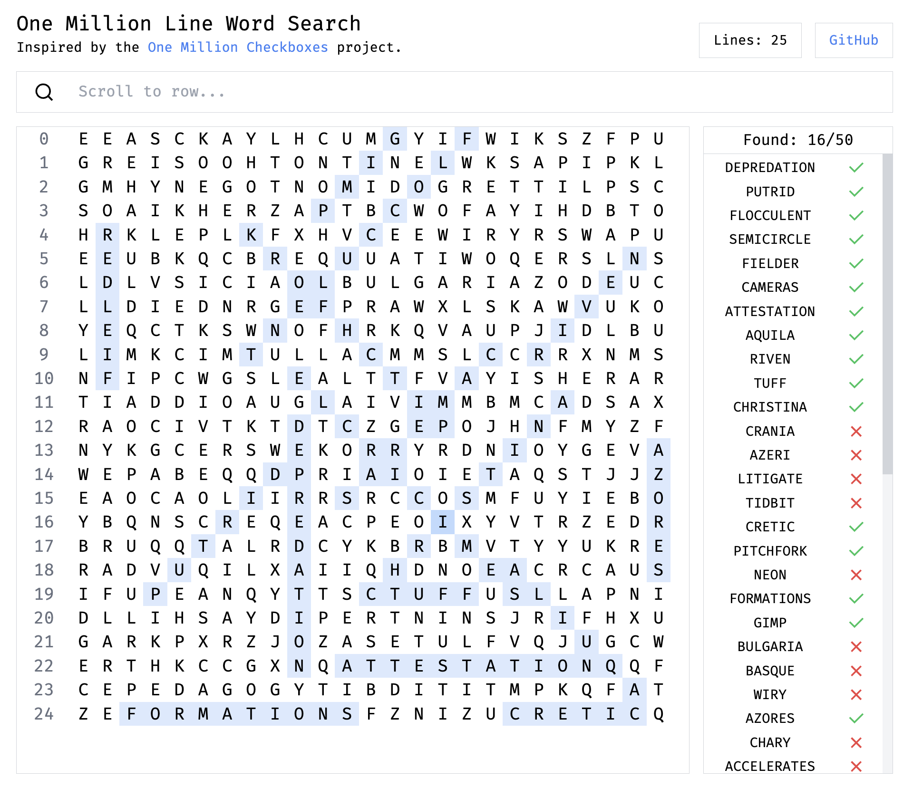

# One Million Line Word Search

This project was inspired by the [One Million CheckBox](https://onemillioncheckboxes.com/) Website.

The website has 3 modes: 25 lines, 100 lines, and 100,000 lines (yes, it said one million but that's a lot of data).

It is build with SvelteKit, TailwindCSS, and Cloudflare Pages.

Words are from [Monkeytype](https://github.com/monkeytypegame/monkeytype/tree/master/frontend/static/languages)
